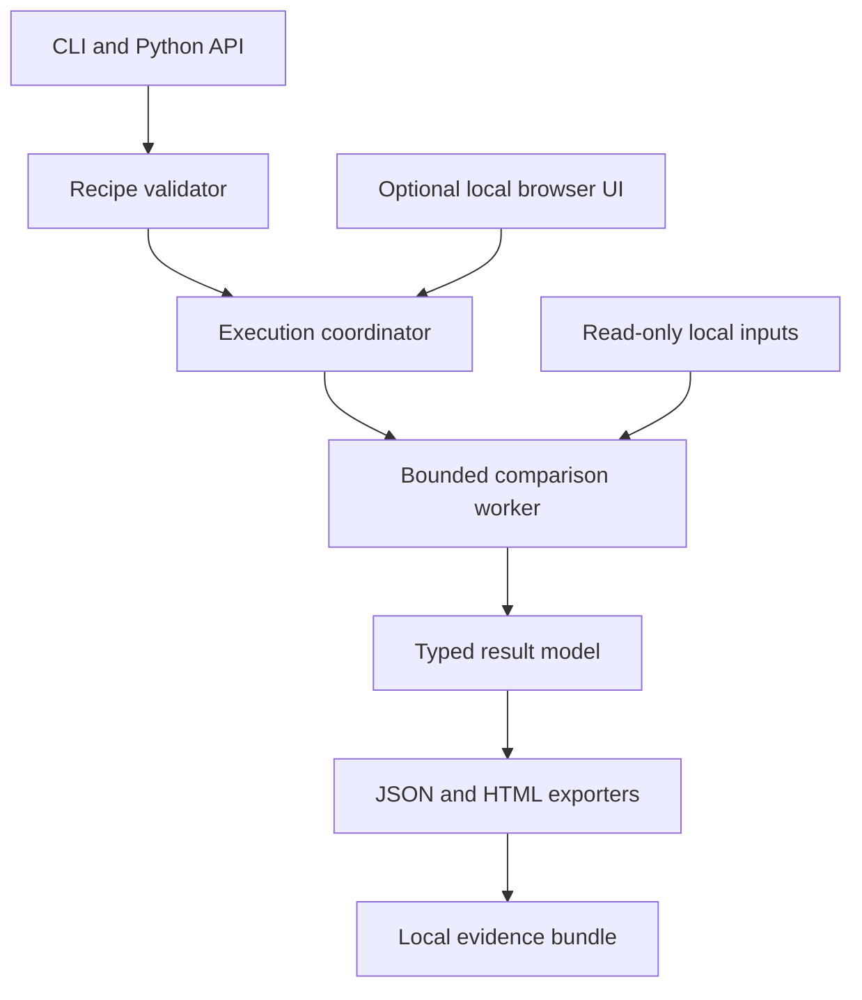
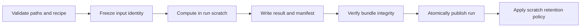
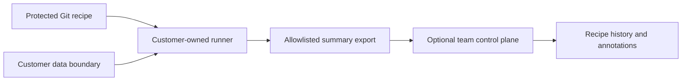

# Parison proposed architecture

## Architectural recommendation

Begin with a Python package, CLI and static report generator. Use one deterministic result model across all interfaces. The pinned DataComPy 1.1.0 spike found incompatible duplicate-key, tolerance and Decimal-evidence semantics, so keyed-v1 uses a small contract-specific engine and keeps external libraries as differential references only.

The default runtime is the user's laptop or CI runner. No cloud backend, account, database service, queue or orchestration platform is necessary for the first product. A side project should not acquire enterprise infrastructure before it has repeat users.

## Component map



The worker holds processing resources and exposes cancellation/status to the coordinator. It cannot change source files or accept arbitrary code from recipes. Isolation is a design requirement whose actual OS/container enforcement must be tested; a Python subprocess alone is not a security sandbox.

## Proposed modules

| Module | Responsibility | Must not do |
| --- | --- | --- |
| `recipe` | Typed schema, validation, migrations, effective-policy digest | Execute YAML tags, Python or free-form expressions |
| `inputs` | Explicit parsers, input staging/provenance and schema inspection | Ignore parse errors or retrieve arbitrary remote URLs |
| `identity` | Composite keys, null/duplicate checks and coverage | Pair ambiguous duplicates automatically |
| `comparison` | Apply the versioned semantic contract | Change tolerances to obtain a pass |
| `results` | Counts, discrepancies, coverage and outcome precedence | Conflate field counts and unique record counts |
| `artifacts` | Publish evidence atomically, integrity checks and privacy mode | Overwrite a previous run silently |
| `cli` | Commands, exit codes and useful diagnostics | Implement separate comparison logic |
| `viewer` | Static/local investigation interface | Fetch remote assets or mutate computed results |

Names indicate suggested responsibilities, not an existing repository structure.

## Core dependency decision

The compatibility spike checked duplicate handling, tolerance direction, Decimal behavior and evidence access. DataComPy remains useful as a differential baseline on exact, unique-key cases, but is not a runtime adapter for keyed-v1. The executed cases and decision are recorded in [the engine compatibility spike](11-engine-compatibility-spike.md).

The implemented engine uses the Python standard library for CSV and pinned optional Polars support for Parquet. This keeps the default install small while retaining a columnar parser for Parquet. Official Polars streaming capabilities do not guarantee that the full identity, comparison and reporting path stays within memory; the measured envelope remains the source of truth. [Streaming](https://docs.pola.rs/user-guide/concepts/streaming/), [tested support envelope](13-tested-support-envelope.md).

DuckDB is a candidate for later spill-backed execution. Its documentation describes larger-than-memory processing but also limitations and out-of-memory cases. Do not add two interchangeable engines before semantics and memory behavior are tested. [Workload tuning](https://duckdb.org/docs/current/guides/performance/how_to_tune_workloads), [OOM guidance](https://duckdb.org/docs/current/guides/performance/oom).

Select supported stable package releases during the spike, pin dependencies and publish tested versions. Do not adopt a pre-release engine merely because a headline promises better performance.

## Data lifecycle and atomic publication



Create a task-owned temporary directory and a unique output destination. Prefer a protected staged snapshot for reproducibility; copying inputs consumes disk and creates another sensitive copy. A zero-copy mode must document weaker mutation guarantees and perform checks before/after reading. File size and modified time alone do not prove stability. Abort on detected change.

Write artifacts into a staging directory on the destination filesystem, then publish with an atomic filesystem operation where supported. Filesystems/platforms differ; test crash behavior and document limitations. A run-level ERROR must never leave a partial bundle labelled complete.

Proposed evidence layout:

```text
run-directory/
  manifest.json             provenance, versions, completeness, checksums
  effective-recipe.json     immutable policy used by the run
  result.json               canonical classifications and aggregate counts
  report.html               self-contained bounded evidence view
  discrepancies.parquet     optional explicit-sensitive export
  review-notes.json         separate annotations, never rewritten results
```

Do not retain staged source copies by default after completion. The manifest says whether rerunning requires the user to provide originals again. Artifact retention and deletion are explicit choices, not invisible cache behavior.

## Recipe and API contract

Illustrative configuration, not a supported syntax yet:

```yaml
recipe_version: 1
comparison_mode: keyed
keys: [order_id]
scope:
  snapshot: synthetic-orders-v1
  completeness: full
identity:
  null_keys: reject
  duplicates: reject
columns:
  order_id:
    type: string
    comparison: exact
  total:
    type: decimal
    comparison: numeric
    tolerance:
      formula: symmetric-v1
      absolute: "0.01"
      relative: "0"
output:
  sensitivity: summary
```

File bindings and resource limits are runtime arguments, not embedded credentials. Decimal configuration uses strings to avoid YAML numeric parsing changing precision. Reject unknown keys, alias explosions and unsupported recipe versions. Exclusions need explicit fields and rationale.

Expose CLI first and a small Python API second. R, Airflow, Dagster, GitHub Actions and Azure DevOps can invoke the CLI using its result/exit-code contract; no dedicated adapter is needed initially. These integrations do not run the source transformations for the user.

## Scale envelope

No performance promise exists. Benchmark keyed comparison across narrow/wide files, string-heavy keys, low/high mismatch rates and skewed data. Capture elapsed time, peak RSS, disk usage, input bytes and output bytes. Wider rows and long strings can dominate even at modest row counts.

Use full scans for counts, bounded evidence collection and paginated rendering. Bound preview size, sorting and discrepancy exports. A future partition plan assigns equal keys to the same partition, checks identity across all partitions and accumulates exact global counts. Hash partitioning needs collision-safe typed identity and does not by itself prove row equality.

Memory/time/disk exhaustion returns ERROR. An explicitly sampled diagnostic comparison returns INCONCLUSIVE. Neither quietly falls back to sampling and returns PASS.

## Optional local UI

If usability tests justify it, serve a packaged TypeScript/React interface with a small Python localhost service. Bind loopback only, use an unpredictable session token, check Host/Origin and protect mutating requests. Disable remote access, permissive CORS and ambient filesystem browsing. Use a narrow input-selection/run API, not an arbitrary shell endpoint.

SQLite may index local run metadata later; the evidence bundle remains independently inspectable. Do not store all datasets in browser IndexedDB or serialize huge tables into React state. An installable desktop wrapper is deferred until packaging demand justifies its maintenance.

## Future team architecture



The control plane would require authentication, authorization, tenant isolation, retention and signed/bound runner submissions. This is a future design direction, not an implemented feature. Metadata-only does not mean nonsensitive. Keep raw discrepancy artifacts customer-side unless a separately authorized sharing design exists.

## Decision register

Adopt CLI-first, file-first, deterministic semantics and one result schema now. Keep the contract-specific engine following the DataComPy spike. Defer DuckDB fallback, connectors, web service, hosted collaboration and agent-specific protocol adapters. Revisit only with a failing technical requirement or observed user demand.
