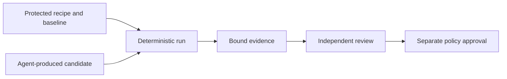

# Parison in an AI development market

This document separates market resilience from optional AI features. The baseline architecture remains deterministic and model-free. A customer needs neither a model subscription nor permission to upload data to an AI service.

## Honest conclusion

Parison is not AI-proof. An assistant can generate joins, assertions, recipes and HTML reports. Coding ability alone is not a defensible advantage. Strong existing libraries also make one-off comparisons inexpensive without AI.

The opportunity is to become a trusted, maintained execution-and-evidence layer that developers or agents invoke instead of repeatedly constructing and checking one-off scripts. That can be valuable, but is already a competitive direction: Datafold markets AI migration/code-review workflows, and its product page exposes data-diff tools through MCP. These are vendor offerings, not independent evidence that AI makes comparison correct. [AI workflows](https://www.datafold.com/ai-agents/), [product capabilities](https://www.datafold.com/).

## What AI can commoditize

| Layer | Replacement risk | Product response |
| --- | --- | --- |
| Boilerplate comparison script | Very high | Do not charge principally for code generation |
| Simple report layout | High | Compete on investigation workflow and faithful evidence |
| YAML recipe authoring | High | Keep schema documented and usable without a model |
| Numeric/identity semantics | Copyable, but easy to mishandle | Publish a precise contract and adversarial fixtures |
| Ongoing compatibility and regression coverage | Requires continued work | Maintain tested releases and transparent changes |
| CI policy binding and reproducibility | Requires workflow discipline | Make scope, recipe, inputs and commit binding inspectable |
| Distribution and trust | Not created by a generated script alone | Earn repeated use; do not assume a moat exists |

These are strategic inferences, not measured forecasts. A competitor can implement the same features. A growing corpus of tests, good defaults and integration quality can create practical switching preference, but none is an unassailable moat.

## The same agent must not define success

An agent could modify a transformation and then widen tolerance, drop a problematic field or replace the baseline until the comparison passes. This is an authority problem even if the comparison engine is deterministic.

Pin protected recipes separately from the code under review. Permit proposed policy edits, but require independent approval. Never let a model suppress inconclusive states, invent a passing run or sign a release decision.

## Agent-compatible without embedded AI

The initial CLI and versioned JSON result are enough for tool-using agents. A script can invoke a comparison and consume bounded structured output. Keep source data and execution customer-side. Protocol-specific wrappers are optional future distribution adapters, not the core product.

An adapter should restrict paths, forbid arbitrary code, bound concurrency and return counts plus safe references by default. Detailed evidence access requires an explicit policy. Raw rows reaching an agent's context may leave the local machine depending on the agent/provider configuration; a local Parison process does not prevent that.

## Optional AI applications, only after the baseline

1. Suggest column mappings using nonsensitive schema metadata. Require human confirmation and detect ambiguity.
2. Draft a recipe from a written comparison requirement. Validate the schema, show every effective rule and require approval before a gate uses it.
3. Summarize already-computed discrepancy categories. Cite result locations and do not invent causes or totals.

Defer autonomous root-cause diagnosis, transformation repair and policy approval. There is no need to select a provider now. Optional features need separate privacy, retention, cost and evaluation decisions; they must not change baseline availability.

Report text and column names are untrusted input. Prompt injection tests should include instructions embedded in cells, malicious schema labels and requests to exfiltrate other files. Models should have no direct filesystem/database/write credentials, and deterministic output validation should reject unsupported claims.

## A practical AI-substitution benchmark

Give independent engineers the same synthetic tasks. Compare current scripts/DataComPy, their chosen coding assistant generating a solution, and Parison. Include all setup, debugging, rule review, rerun and sharing effort. Do not deliberately cripple the AI baseline or use an outdated model to make Parison look good.

Hide some injected defects from task descriptions: duplicate-key multiplication, null-to-zero conversion, decimal precision loss, time-zone shifts, a renamed required field and incomplete processing. Measure false passes, correct defect explanations, reproducibility, resource use and maintenance after a new input variation.

Generated scripts may win. If they consistently provide equally understandable and reproducible results with less total effort, narrow Parison toward a reusable evidence format/report viewer or stop pursuing a paid standalone product.

## Long-term survival strategy

Keep correctness independently inspectable, publish fixture-based regression results and make integration friction low. Help agents verify changes rather than competing to be another general coding agent. Invest in product reliability and distribution only after repeat use.

Do not promise that more AI-written code automatically creates a larger market. It might increase validation demand, or improved agents might absorb the task. Track that uncertainty through repeated comparative tests and user behavior rather than marketing claims.
