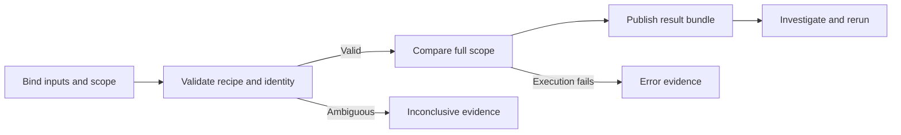
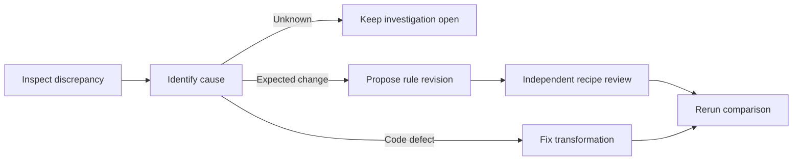
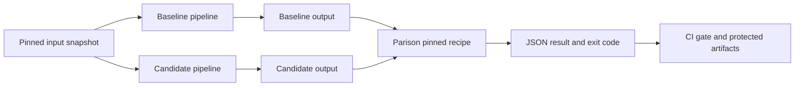

# Parison workflows and usability

All commands, screens and flows are proposed. No executable product exists yet. Diagrams use compact, standard Mermaid flowcharts, with explanations outside the nodes.

## End-to-end comparison



The user declares why the inputs should agree: same source snapshot, transformation scope and extraction cutoff. File timestamps alone cannot establish equivalence. A materially mismatched scope produces an inconclusive result, not a misleading difference count presented as migration failure.

Parsing preview is advisory and visibly sampled. The authoritative run checks every evaluated row. Before execution, show the selected keys, column mappings, type policies, excluded columns, normalization, tolerance formula and output sensitivity mode.

## Recipe lifecycle


Recipe editing cannot silently modify an existing run. Even an absolute path change is recorded in runtime bindings; the comparison rules have their own semantic digest. A rule change creates a new recipe version and a new run. Local review comments express the reviewer's disposition, not a rewritten computational result.

A draft recipe may suggest column matches from identical names, but the user confirms them. No automatic case folding, whitespace trimming, numeric key casting or inferred fuzzy matching is applied to identity.

## Investigation journey

Start with a summary: execution outcome, completeness, scope, record counts, missing/extra counts, unique mismatched-row count and coverage by field. Next show the most affected fields and declared groups. Finally drill into a record or a bounded deterministic sample.

For each discrepancy display baseline value, candidate value, type, rule, numeric delta where relevant, tolerance allowance and classification. Keep raw differences distinguishable from normalized differences. Masked fields must show “masked,” not blank values that appear to match.

The report should include excluded columns and unresolved preflight issues as prominently as successful checks. Distinguish “zero mismatches” from “zero comparable records.” Do not let a sampled preview or empty result become a green completion badge.



An expected-difference note does not turn a failed result into a pass. Future allowance requires a reviewed rule. Avoid “ignore all errors in this column” shortcuts; require scope and rationale for exclusions and keep their effect visible.

## CI integration



The pipeline is responsible for generating and freezing the input snapshot. Parison evaluates supplied outputs and declared provenance. A secure CI wrapper binds the protected recipe to the candidate commit; it should not let an untrusted pull request widen tolerances and approve itself.

Proposed usage:

```sh
parison validate-recipe recipes/orders.yaml
parison compare --recipe recipes/orders.yaml \
  --baseline baseline/orders.parquet \
  --candidate candidate/orders.parquet \
  --output runs/orders-check
```

Any nonzero code blocks a strict gate. Preserve the result bundle on difference, error and inconclusive outcomes, not only on success. Disable report publication on public PRs when data or sensitive metadata could leak. An HTML report is not safe simply because raw columns are masked.

## Interface progression

First implement a CLI and static HTML report with no remote assets. Add a local browser workbench only after measuring investigation friction. Its conceptual layout is:

```text
Run identity | Outcome | Full/sampled coverage | Recipe digest
Scope and exclusions | Input provenance | Execution limits
Field summary and group summary
Filters: discrepancy class / field / key / declared group
Evidence table: baseline / candidate / rule / classification
Reproduce command | Export sensitivity mode | Review notes
```

Keyboard navigation, accessible tables, copyable commands and explicit loading/cancellation states matter more than animations. Do not force mobile-first layout for a desktop investigation task. Start with a manageable summary and disclose detailed evidence progressively.

## Usability tests

Give unfamiliar engineers synthetic cases containing equal totals with offsetting errors, a duplicate-key ambiguity and a tolerance boundary. Ask them to identify the cause, explain why the result passed or failed and reproduce the run. Measure completion, correct explanations, time and help requests.

Test whether users understand that “within tolerance” still means different, that baseline is not truth and that missing keys invalidate identity. Validate terminology before visual polish. Report improvements relative to the actual baseline workflow, including recipe setup time—not only the fastest repeat run.
